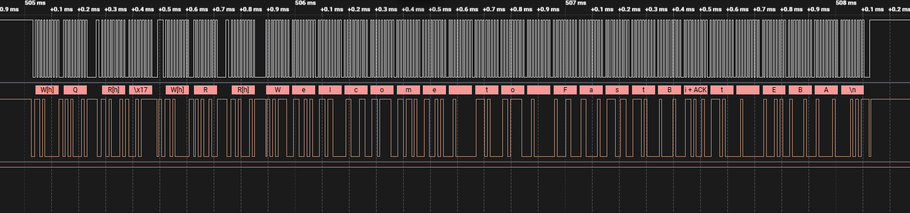
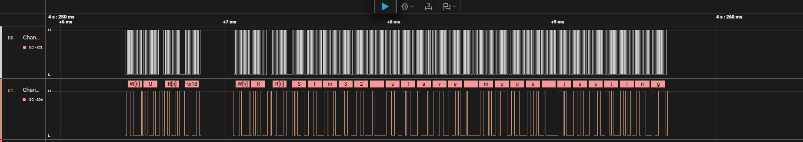

# STM32F411 Bare-Metal Drivers & Interfacing

This repository contains modular, register-level bare-metal peripheral drivers and practical interfacing applications developed for the **STM32F411CEU6 (WeAct Black Pill)** microcontroller (ARM Cortex-M4).

The low-level driver architecture is based on the FastBit Embedded Brain Academy model, focusing on direct register-level hardware control without vendor abstraction layers (HAL/LL).

---

## 🛠 Features

- **Direct Register Access:** Custom peripheral drivers written from scratch via memory-mapped peripheral structs.
- **Hardware Peripherals Covered:**
  - **USART:** Full-duplex asynchronous communication, configurable baud rates, word lengths (8/9-bit), parity control, and hardware flow control (CTS/RTS). Features robust **Interrupt (IRQ) handling** for non-blocking TX/RX (`TXE`, `TC`, `RXNE`), Idle line detection, and Error management (`ORE`, `FE`, `NE`) via application event callbacks.
  - **I2C:** Master and Slave modes (Standard Mode 100 kHz & Fast Mode), clock control, ACK management, and address generation. Implements both Polling (blocking) and Interrupt-driven (non-blocking) data transfers.
  - **SPI:** Master/Slave transmission, hardware SS management, full-duplex communication.
  - **GPIO:** Pin configuration, modes (Input, Output, Alternate Function, Analog), Pull-Up/Pull-Down, speed configuration, and software debouncing.
- **Toolchain:** Modern CMake + Ninja build system with `arm-none-eabi-gcc` cross-compiler and Cortex-Debug support in VS Code.

---

## 🚀 Application Example: Button-Triggered I2C Transmission

The current reference application demonstrates an I2C communication bridge between the STM32F411 Master and an external Slave (Arduino Uno).

### Hardware Wiring

| STM32F411 (Black Pill) | External Device / Pin | Description |
| :--- | :--- | :--- |
| **PA0** | On-board KEY button | Active-LOW, internal Pull-Up enabled |
| **PB6** | Arduino A5 (SCL) | I2C1 Clock line (Open-Drain + Pull-Up) |
| **PB7** | Arduino A4 (SDA) | I2C1 Data line (Open-Drain + Pull-Up) |
| **GND** | Arduino GND | Common ground reference |

### Hardware Setup

<p align="center">
  
</p>

### Operation Logic
1. Pin `PA0` is held high at 3.3V via internal Pull-Up resistor.
2. Pressing the on-board button pulls `PA0` to `GND` (Active-LOW).
3. The software filters mechanical contact bounce via verification delay (`btn_is_pressed`).
4. Upon confirmation, the STM32 initiates a `START` condition, transmits the payload buffer (`"testdata"`) to slave address `0x68`, and generates a `STOP` condition.
5. The loop waits for key release to prevent flood transmission.

---

## 🔍 Protocol Verification & IT Logic (Logic Analyzer)

Bus transaction timing, packet integrity, and interrupt-driven payload deliveries were physically verified using a logic analyzer on the SCL and SDA lines.

**I2C Master Interrupt (IT) Transmission:**
<p align="center">
  
</p>

**I2C Slave Interrupt (IT) Reception:**
<p align="center">
  
</p>

- **Bus Speed:** 100 kHz (Standard Mode).
- **Packet Sequence:** `START` $\to$ `Address (0x68 + W/R)` $\to$ `ACK` $\to$ `Payload Data` $\to$ `ACK` $\to$ `STOP`.

---

## 📁 Repository Structure

```text
├── docs/                     # Hardware setup photos and logic analyzer captures
├── drivers/
│   ├── Inc/                  # Peripheral header files and register mappings
│   └── Src/                  # Driver implementations (GPIO, I2C, SPI, USART)
├── Examples/                 # Functional tests and communication demos
├── cmake/                    # Toolchain and compiler flag definitions
├── CMakeLists.txt            # CMake build configuration
├── STM32F411.svd             # SVD file for register debugging in Cortex-Debug
└── stm32f411xe_flash.ld      # Linker script for STM32F411xE (512KB Flash, 128KB SRAM)